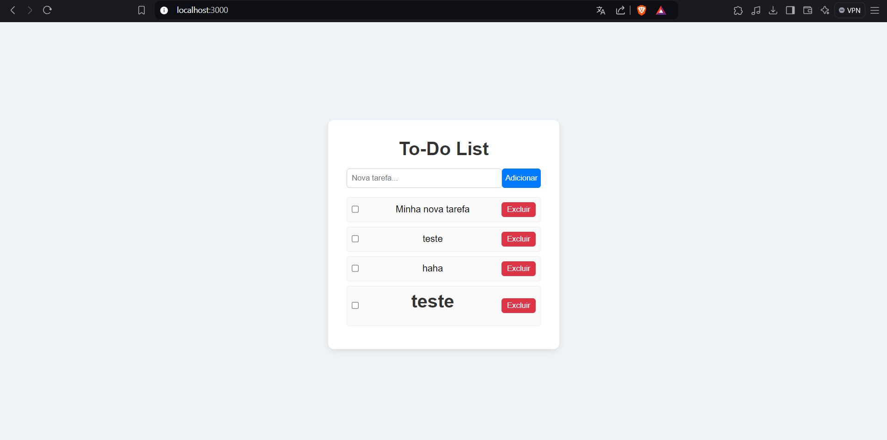
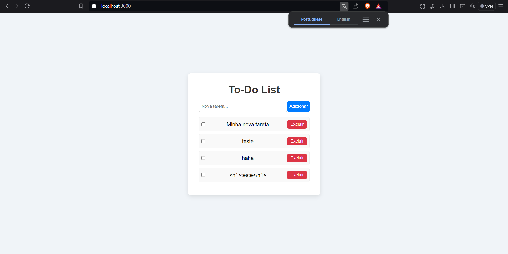

Link de acesso: https://lista-afazeres-mayo.onrender.com/

# To-Do List - Aplicação de Gerenciamento de Tarefas 📝

## Descrição

Esta é uma aplicação web de gerenciamento de tarefas (To-Do List) onde os usuários podem se registrar, fazer login, criar, visualizar, atualizar e excluir suas tarefas. Cada usuário tem sua própria lista de tarefas, garantindo que as informações não sejam compartilhadas entre diferentes contas.

A aplicação foi construída com **Node.js**, **Express**, **Sequelize** e **MySQL** no backend, com **HTML**, **CSS** e **JavaScript** no frontend. A autenticação é feita utilizando **JWT (JSON Web Tokens)**.


## Funcionalidades 📋

- **Registro de usuário**: Permite que novos usuários se cadastrem no sistema.
- **Login**: Usuários autenticados podem acessar suas listas de tarefas.
- **Gerenciamento de Tarefas**:
  - Criar novas tarefas.
  - Marcar tarefas como concluídas ou pendentes.
  - Excluir tarefas.
  - Editar tarefas (em desenvolvimento).
- **Autenticação JWT**: As rotas de tarefas são protegidas por autenticação JWT.
- **Cada usuário tem sua própria lista de tarefas**.


## Tecnologias Utilizadas 🛠️

- **Node.js**: Runtime de JavaScript no servidor.
- **Express**: Framework minimalista para Node.js.
- **Sequelize**: ORM para interagir com o banco de dados MySQL.
- **MySQL**: Sistema de gerenciamento de banco de dados.
- **JWT**: Autenticação baseada em tokens.
- **HTML/CSS/JavaScript**: Frontend da aplicação.

## Instalação e Configuração 🖥️

### Pré-requisitos

- Node.js (v14 ou superior)
- MySQL
- Um editor de código, como o VS Code
- Postman ou similar (opcional para testes de API)

### Passos para Instalação

1. **Clone o repositório**:
   ```bash
   git clone https://github.com/seu-usuario/seu-repositorio.git
   cd seu-repositorio


2. Instale as dependências:
   ```
   npm install

3. Configure o arquivo .env:

Crie um arquivo .env na raiz do projeto e adicione as seguintes variáveis:

```
DB_HOST=localhost         # Host do banco de dados MySQL
DB_PORT=3306              # Porta do banco de dados
DB_NAME=todo_list         # Nome do banco de dados
DB_USER=root              # Usuário do banco de dados
DB_PASS=sua_senha         # Senha do banco de dados
JWT_SECRET=sua_chave_secreta  # Chave secreta para JWT
API_BASE_URL=http://localhost:3000  # URL base da API (ajuste conforme necessário)

```
4. Configuração do banco de dados:

Certifique-se de que você tem o MySQL instalado e rodando. No terminal MySQL, crie o banco de dados:
```
CREATE DATABASE todo_list;
```

5. Inicie o servidor com:
```
 npm start
```


## Possíveis Erros 🛠️

Durante o desenvolvimento da aplicação, encontrei alguns erros que precisei resolver ajustando o código e a estrutura do projeto. Um dos principais erros que enfrentei foi o seguinte:

### 1. Erro de Renderização das Tarefas 📝

Enquanto implementava o frontend, me deparei com um problema na renderização da lista de tarefas. Os itens não estavam aparecendo corretamente alinhados, como mostrado na imagem abaixo:



**Causa**: O problema estava relacionado ao layout HTML combinado com a estilização em CSS. Além disso, percebi que os dados recebidos do backend não estavam sendo devidamente sanitizados, causando inconsistências na exibição.

**Solução**: Para resolver essa questão, fiz as seguintes correções:
- Ajustei o arquivo `style.css` para garantir que os itens da lista de tarefas fossem exibidos corretamente e de forma responsiva.
- Implementei uma sanitização dos dados no JavaScript antes de exibi-los, garantindo que caracteres especiais fossem escapados adequadamente.

Após essas mudanças, o layout ficou mais limpo e funcional, com as tarefas sendo renderizadas corretamente, como pode ser visto na imagem corrigida:



Agora, a aplicação está funcionando perfeitamente e com uma interface muito mais agradável e responsiva. 🚀
